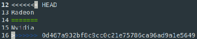
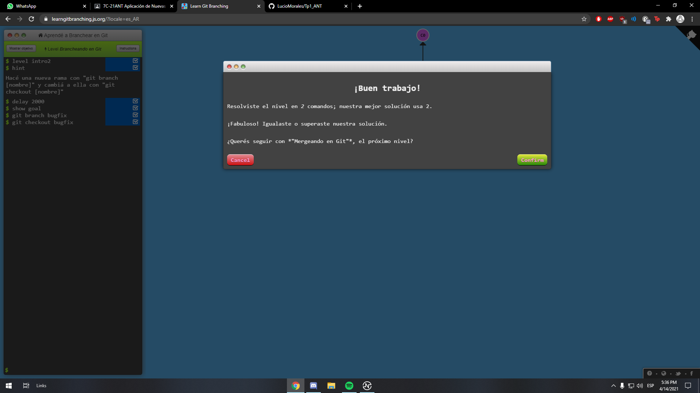
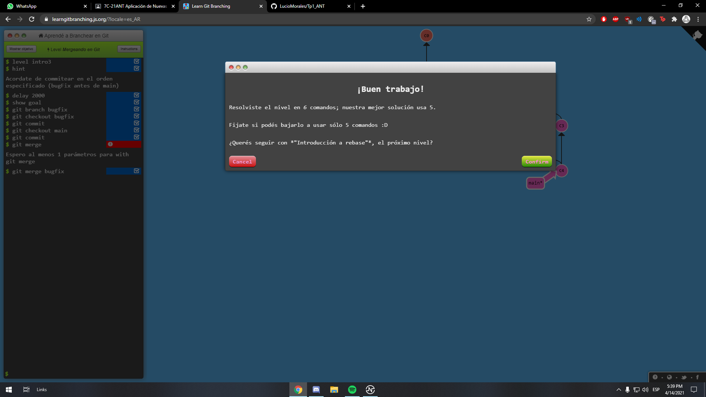
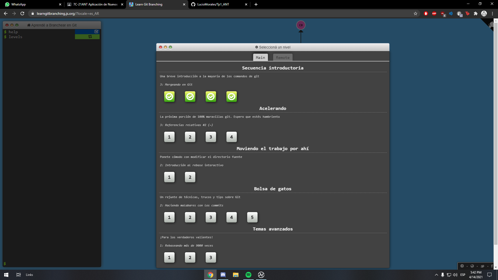

## **Trabajo Práctico N1 ANT**
---
## 1. 
```sh
    ❯ git version
      git version 2.27.0
```
---
## 2.
```sh
    ❯ git init
      Initialized empty Git repository in /home/lucio/Documents/Villada/2021/Tp1 ANT/.git/
    ❯ touch README.md
    ❯ touch cv.md
    ❯ git add .
    ❯ git commit -m "Creacion readme y cv"
[master (root-commit) 28f97c6] Creacion readme y cv
Committer: Lucio <lucio@rakuzanx.sinapsis>
Your name and email address were configured automatically based
on your username and hostname. Please check that they are accurate.
You can suppress this message by setting them explicitly. Run the
following command and follow the instructions in your editor to edit
your configuration file:

    git config --global --edit

After doing this, you may fix the identity used for this commit with:

    git commit --amend --reset-author

 2 files changed, 2 insertions(+)
 create mode 100644 README.md
 create mode 100644 cv.md
```
---
## 3. 
```sh
    ❯ git remote add origin https://github.com/LucioMorales/Tp1_ANT.git
    ❯ git bracn -M main
    ❯ git push -u origin main
Username for 'https://github.com': LucioMorales
Password for 'https://LucioMorales@github.com': 
Enumerating objects: 4, done.
Counting objects: 100% (4/4), done.
Delta compression using up to 4 threads
Compressing objects: 100% (2/2), done.
Writing objects: 100% (4/4), 306 bytes | 306.00 KiB/s, done.
Total 4 (delta 0), reused 0 (delta 0), pack-reused 0
To https://github.com/LucioMorales/Tp1_ANT.git
 * [new branch]      main -> main
Branch 'main' set up to track remote branch 'main' from 'origin'.
```
---
## 4. 
```sh
    ❯ git checkout -b local
Switched to a new branch 'local'
    ❯ touch pullrequest.md
    ❯ git add .
    ❯ git commit -m "Cambios al pullrequest.md"
[local bbe3e04] Cambios al pullrequest.md
 Committer: Lucio <lucio@rakuzanx.sinapsis>
Your name and email address were configured automatically based
on your username and hostname. Please check that they are accurate.
You can suppress this message by setting them explicitly. Run the
following command and follow the instructions in your editor to edit
your configuration file:

    git config --global --edit

After doing this, you may fix the identity used for this commit with:

    git commit --amend --reset-author

 1 file changed, 1 insertion(+)
    ❯ git push
Username for 'https://github.com': LucioMorales
Password for 'https://LucioMorales@github.com': 
Enumerating objects: 5, done.
Counting objects: 100% (5/5), done.
Delta compression using up to 4 threads
Compressing objects: 100% (3/3), done.
Writing objects: 100% (3/3), 317 bytes | 317.00 KiB/s, done.
Total 3 (delta 2), reused 0 (delta 0), pack-reused 0
remote: Resolving deltas: 100% (2/2), completed with 2 local objects.
To https://github.com/LucioMorales/Tp1_ANT.git
   c0af6a7..bbe3e04  local -> local
```


---
## 5. 
```sh
    ❯ git clone https://github.com/LucioMorales/Tp1_ANT.git
```

```sh
    ❯ git add .
    ❯ git commit -m "Cambios al cv para generar error"
    ❯ git push
    ❯ git add .
    ❯ git commit -m "Error cv 2"
[main 9534fef] Error cv 2
 Committer: Lucio <lucio@rakuzanx.sinapsis>
Your name and email address were configured automatically based
on your username and hostname. Please check that they are accurate.
You can suppress this message by setting them explicitly. Run the
following command and follow the instructions in your editor to edit
your configuration file:

    git config --global --edit

After doing this, you may fix the identity used for this commit with:

    git commit --amend --reset-author

 1 file changed, 1 insertion(+), 1 deletion(-)
    
    ❯ git push
Username for 'https://github.com': LucioMorales
Password for 'https://LucioMorales@github.com': 

To https://github.com/LucioMorales/Tp1_ANT.git
 ! [rejected]        main -> main (fetch first)
error: failed to push some refs to 'https://github.com/LucioMorales/Tp1_ANT.git'
hint: Updates were rejected because the remote contains work that you do
hint: not have locally. This is usually caused by another repository pushing
hint: to the same ref. You may want to first integrate the remote changes
hint: (e.g., 'git pull ...') before pushing again.
hint: See the 'Note about fast-forwards' in 'git push --help' for details.

    ❯ git pull
warning: Pulling without specifying how to reconcile divergent branches is
discouraged. You can squelch this message by running one of the following
commands sometime before your next pull:

  git config pull.rebase false  # merge (the default strategy)
  git config pull.rebase true   # rebase
  git config pull.ff only       # fast-forward only

You can replace "git config" with "git config --global" to set a default
preference for all repositories. You can also pass --rebase, --no-rebase,
or --ff-only on the command line to override the configured default per
invocation.

remote: Enumerating objects: 5, done.
remote: Counting objects: 100% (5/5), done.
remote: Compressing objects: 100% (2/2), done.
remote: Total 3 (delta 1), reused 3 (delta 1), pack-reused 0
Unpacking objects: 100% (3/3), 340 bytes | 68.00 KiB/s, done.
From https://github.com/LucioMorales/Tp1_ANT
   fb26fc7..0d467a9  main       -> origin/main
Auto-merging cv.md
CONFLICT (content): Merge conflict in cv.md
Automatic merge failed; fix conflicts and then commit the result.
```

```sh
    ❯ git add .
    ❯ git commit -m "Solucion de errores en cv"
[main ef3afc3] Solucion de errores en cv
 Committer: Lucio <lucio@rakuzanx.sinapsis>
Your name and email address were configured automatically based
on your username and hostname. Please check that they are accurate.
You can suppress this message by setting them explicitly. Run the
following command and follow the instructions in your editor to edit
your configuration file:

    git config --global --edit

After doing this, you may fix the identity used for this commit with:

    git commit --amend --reset-author

    ❯ git push
Username for 'https://github.com': LucioMorales
Password for 'https://LucioMorales@github.com': 
Enumerating objects: 8, done.
Counting objects: 100% (8/8), done.
Delta compression using up to 4 threads
Compressing objects: 100% (4/4), done.
Writing objects: 100% (4/4), 539 bytes | 134.00 KiB/s, done.
Total 4 (delta 1), reused 0 (delta 0), pack-reused 0
remote: Resolving deltas: 100% (1/1), completed with 1 local object.
To https://github.com/LucioMorales/Tp1_ANT.git
   0d467a9..ef3afc3  main -> main
```
   
* **Local**: The file on the branch where you are merging

* **Remote**: The file on the branch from where you are merging

* **Base**: The common ancestor of $LOCAL and $REMOTE, ie. the point where the two branches started diverting the considered file

---
## 6.





